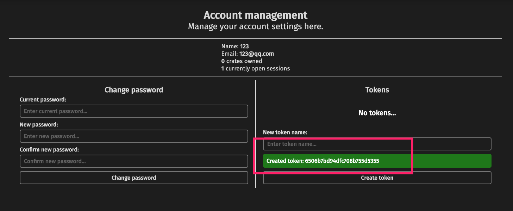

# Rust crates私有化部署指南(private alternative registry)
在`Rust`中,一般使用外部依赖的库部署在[https://crates.io/](https://crates.io/)。我们直接在`Cargo.toml`的`dependencies`配置即可，列如下配置：

```toml
...
[dependencies]
rand = "0.7.3"
serde = "1.0"
serde_derive = "1.0"
serde_json = "1.0"
lazy_static = "1.4.0"
...
```

如果细心的同学会发现，如果`rand`库更新到`rand = "0.7.4"`时，我们执行`cargo update`，`Cargo.lock`会自动更新`rand`到最新的`0.7.4`版本。这主要是`Rust`采用了[语义化版本](https://semver.org/)。

但是这样的依赖对于`Rust`提供的`crates.io`是没问题的，面对私有化的项目，即不能共享到公开的`crates`上，又想做到私有依赖，问题就暴露了。

## 2.cargo私有化git依赖
一般来说，企业的私有代码，都依赖于私有git仓库。翻过`cargo`的文档时，这里就提到了一个关于git私有化依赖的问题，详见链接：

* [https://doc.rust-lang.org/cargo/reference/specifying-dependencies.html#specifying-dependencies-from-git-repositories](https://doc.rust-lang.org/cargo/reference/specifying-dependencies.html#specifying-dependencies-from-git-repositories)

这里的git私有化不外乎这几种依赖：`branch`依赖，`tag`依赖，`commit-id`依赖，列如下配置：

```toml
[dependencies]
rand = { git = "https://github.com/rust-lang-nursery/rand", branch = "master" }
rand = { git = "https://github.com/rust-lang-nursery/rand", tag = "0.2.2" }
rand = { git = "https://github.com/rust-lang-nursery/rand", rev = "e2112c4" }
```

看到这里，我们就想到了才有私有化`git`方式依赖，我们也这样做了。接下来问题便发生了。

* 2.1 在项目中，我们定义了一些公共依赖的结构：`hula_common`私有仓库。
* 2.2 `A`项目(lib)使用了`hula_common`的仓库，依赖`tag="0.1.5"`如下

```toml
hula_common = { package = "hula_common", git = "ssh://git@git.baoyachi.com/hula/hula_common.git" , tag = "0.1.5" }
```

* 2.3. `B`项目(lib)也使用了`hula_common`的仓库，依赖`tag="0.1.4"`如下
```toml
hula_common  = { package = "hula_common", git   = "ssh://git@git.baoyachi.com/hula/hula_common.git" , tag = "0.1.4" }
```
* 2.4 `A`lib和`B`lib都同时依赖了`hula_common`，两者区别就是引用的git的`tag`版本不同。

* 2.5 在主程序的`project`名称是`fuzz`中,`fuzz`同时依赖了`A`,`B`,`hula_common`等私有`lib`,大致如下：
```toml
...
[dependencies]
serde_derive = "1.0.111"
serde = "1.0.111"
serde_json = "1.0.53"
...

hula_common = { package = "hula_common", git = "ssh://git@git.baoyachi.com/hula/hula_common.git" , tag = "0.1.5" }
B = { package = "B", git = "ssh://git@git.baoyachi.com/hula/B.git" , tag = "0.3.2" }
A = { package = "A", git = "ssh://git@git.baoyachi.com/hula/A.git" , tag = "0.5.7" }
...
```
* 2.6 当我们编译`fuzz`时，居然编译报错?
```bash
error[E0308]: mismatched types
   --> src/common/query.rs:196:23
    |
196 |         let items = self.query(pos, key)?;
    |                                ^^^^^ expected struct `hula_common::query::Container`, found struct `hula_common::query::Container`
    |
    = note: expected reference `&hula_common::query::Container`
               found reference `&hula_common::query::Container`
    = note: perhaps two different versions of crate `hula_common` are being used?
```
大致意思是：`hula_common`使用了不同版本(different versions),导致编译报错。这个很让人诡异：
对于上面提到的`rand`在`crates.io`的依赖，如果版本更新，会自动更新，反而因为`git`的`tag`差异，Rust认为导入的`crate`不一致，这个问题纠结了我很久。

一方面，想要让所有库依赖同一个`tag`，这个着实让人头疼。`hula_common`的定义由`0.1.4`->`0.1.5`,可能只是针对`B`项目增加的局部字段，而不会影响`A`项目的编译。按理说，若`Rust`遵循[https://semver.org](https://semver.org/)语义化版本的依赖，应该是可以正常编译过的，但现实是failed。

如果熟悉`go mod`的依赖，就会发现，上面这种依赖方式，在`go mod`编译时，是完全ok的。同样的问题，对于`Rust`来说，为何编译失败？因此，带着问题，寻求官方的回复，有人便给了反馈,原话如下：

```bash
Cargo has no way of knowing that two different tags point to compatible projects. If you want a shared dependency on a git project it has to be the same commit to be compatible. Cargo will happily build both tags into the same project, but it will not treat types from one as the same as types from the other.

...
git tags are arbitrary strings, we have no way to know if "master" and "dev" are sember compatible. crates.io versions are semver versions, so we can determine that "^0.1.4" can resolve to 0.1.5. Note that if you have "=0.1.4" as a requirement on crates.io you would also get an error.

Your company may want to create a private alternative registry.
```

大致意思是：Cargo无法知道两个不同的tag指向兼容的项目。如果要共享对git项目的依赖，则必须具有相同的commit才能兼容。本身git的`tag`可以是任意字符串，`Cargo`无法知道`master`和`dev`是否与`semver versions`的版本兼容。

如果真的要使用`semver versions`让`Cargo`认识，需要创建类似`crates.io`的私有`private alternative registry`。

## 3 alternative registry
在`Rust 1.34.0`的版本中，支持了`Alternative cargo registries`。什么意思？通常我们不仅仅依赖`crates.io`上的代码，在企业或其他组织中，存在大量私有仓库代码（gitlab）,使得我们在对于`Cargo`依赖时，既需要依赖`crates.io`，又要有其他的`registry`依赖，`1.34.0`的版本开始支持了该特性。大致配置如下：

* 3.1 创建在git上的`crate index`的存储仓库
假设我们在gitlab上创建了一个关于私有的`crates`的存储仓库：`https://git.baoyachi.com/hula/crates-index.git`。


* 3.2 找到`.cargo`的根目录，创建`config.toml`文件（./cargo/config.toml）,在`config.toml`配置自己的`registry`,假设我们命名:`git-baoyachi`, 并做如下配置：
```toml
[registries]
git-baoyachi = { index = "https://git.baoyachi.com/hula/crates-index" }
```

或是这样：
```toml
[registries.git-baoyachi]
index = "https://git.baoyachi.com/hula/crates-index"
```
**上面两者是等价的，二选一即可。**

注意：假设私有仓库是`gitlab`,这里的`index`的链接即为gitlab的链接，即为：`https://git.baoyachi.com/hula/crates-index.git`。这里我们使用的是`http`或`https`的方式，如果是ssh的话，列配置如下：

```rust
[registries.git-baoyachi]
index = "ssh://git@git.baoyachi.com/hula/crates-index.git"
```

或是这样：

```rust
[registries]
git-baoyachi = {index = "ssh://git@git.baoyachi.com/hula/crates-index.git"}
```

请注意:**从gitlab的克隆按钮复制/粘贴时，SSH网址有两个主要区别：必须在前面添加ssh://，并将gi.xxx.com之后的`:`更改为`/`**

* 3.3 配置crates备用注册表的服务
如果读了文档的，细心的同学会发现，文档中只是介绍了怎么配置，因为并没有告诉怎么搭建私有的`alternative registry`。好在开源社区提供了私有化的crates的注册服务:[https://github.com/Hirevo/alexandrie](https://github.com/Hirevo/alexandrie)

我们跟着文档手册手动搭一个试试：[https://hirevo.github.io/alexandrie/installation-script.html](https://hirevo.github.io/alexandrie/installation-script.html)
* 3.3.1 创建安装配置脚本:`alexandrie.sh`

```bash
#!/bin/bash

# function to run when an error is encountered
function setup_error {
    echo "-------- An error occurred during configuration --------"
    exit 1
}

# exit on error
trap 'setup_error' ERR

# directory to clone Alexandrie into:
ALEXANDRIE_DIR="$2";

# URL to the crate index repository.
CRATE_INDEX_GIT_URL="$1";


while ! git ls-remote -h $CRATE_INDEX_GIT_URL; do
    read -p 'CRATE_INDEX_GIT_URL: ' CRATE_INDEX_GIT_URL;
done

if ! cargo -V; then
    echo;
    echo "In order to build an instance of Alexandrie, you need to have Rust installed on your system";
    echo "You can learn how to install Rust on your system on the official Rust website:";
    echo "https://www.rust-lang.org/tools/install";
    echo;
    ! :;    # trigger error trap
fi

if [ -d "$ALEXANDRIE_DIR" ]; then
    echo
    echo "'$ALEXANDRIE_DIR' (ALEXANDRIE_DIR) is an existing directory, pulling latest changes ...";
    cd "$ALEXANDRIE_DIR";
    git pull;
    echo "Changes have been pulled successfully !";
    echo;
else
    echo;
    echo "Cloning Alexandrie in '$ALEXANDRIE_DIR' ...";
    git clone https://github.com/Hirevo/alexandrie.git "$ALEXANDRIE_DIR";
    cd "$ALEXANDRIE_DIR";
    echo "Successfully cloned Alexandrie !";
    echo;
fi

echo "Building Alexandrie (using the default features)...";
echo "(keep in mind that the default features may not fit your use-case, be sure to review them before deplying it to production)";
cargo build -p alexandrie;
echo "Alexandrie has been built successfully !";

# create the directory serving as the storage of crate archives.
mkdir -p crate-storage;

# setup the crate index.
if [ -d crate-index ]; then
    echo;
    echo "'${ALEXANDRIE_DIR}/crate-index' is an existing directory, pulling latest changes ...";
    cd crate-index;
    git pull;
    echo "Changes have been pulled successfully !";
    echo;
else
    echo;
    echo "Cloning crate index in '${ALEXANDRIE_DIR}/crate-index' ...";
    git clone "$CRATE_INDEX_GIT_URL" crate-index;
    cd crate-index;
    echo "Successfully cloned the crate index !";
    echo;
fi

# configure the crate index
if [ ! -f config.json ]; then
    echo "The crate index does not have a 'config.json' file.";
    echo "Creating an initial one (please also review it before deploying the registry in production) ..."
    cat > config.json << EOF;
{
    "dl": "http://$(hostname):3000/api/v1/crates/{crate}/{version}/download",
    "api": "http://$(hostname):3000",
    "allowed-registries": ["https://github.com/rust-lang/crates.io-index"]
}
EOF
    git add config.json;
    git commit -m 'Added `config.json`';
    git push -u origin master;
    echo "Initial 'config.json' file has been created and pushed to the crate index !";
    echo;
fi

echo "Alexandrie should be good to go for an initial run.";
echo "You can start the Alexandrie instance by:";
echo "  - navigating to '${ALEXANDRIE_DIR}'";
echo "  - tweaking the 'alexandrie.toml' file";
echo "  - run `./target/debug/alexandrie`";
echo;

```
注意：该脚本需要两个参数：
* `ALEXANDRIE_DIR`: 本地的路径,列如：/home/baoyachi/alexandrie
* `CRATE_INDEX_GIT_URL`:就是我们在3.1创建的`crats index`的git地址，如：`ssh://git@git.baoyachi.com/hula/crates-index.git`

* 3.3.2 执行脚本
```bash
sh alexandrie.sh ssh://git@git.baoyachi.com/hula/crates-index.git /home/baoyachi/alexandrie
```

解释下该脚本做的工作：clone `CRATE_INDEX_GIT_URL`仓库，创建`config.json`,配置如下：
```json
{
    "dl": "http://{{host:port}}/api/v1/crates/{crate}/{version}/download",
    "api": "http://{{host:port}}",
    "allowed-registries": ["https://github.com/rust-lang/crates.io-index"]
}
```
这里的`host`,`port`最终换成线上部署的服务。


* 3.3.3 启动服务
```bash
cd /home/baoyachi/alexandrie
./target/debug/alexandrie alexandrie.toml
```
服务启动完成，大致输出如下：
```bash
➜  alexandrie git:(master) ./target/debug/alexandrie alexandrie.toml
Jul 26 22:23:36.382 INFO running database migrations, version: 0.1.0
Jul 26 22:23:36.383 INFO setting up request logger middleware, version: 0.1.0
Jul 26 22:23:36.383 INFO setting up cookie middleware, version: 0.1.0
Jul 26 22:23:36.384 INFO setting up authentication middleware, version: 0.1.0
Jul 26 22:23:36.384 INFO mounting '/', version: 0.1.0
Jul 26 22:23:36.384 INFO mounting '/me', version: 0.1.0
Jul 26 22:23:36.384 INFO mounting '/search', version: 0.1.0
Jul 26 22:23:36.385 INFO mounting '/most-downloaded', version: 0.1.0
Jul 26 22:23:36.385 INFO mounting '/last-updated', version: 0.1.0
Jul 26 22:23:36.385 INFO mounting '/crates/:crate', version: 0.1.0
Jul 26 22:23:36.386 INFO mounting '/account/login', version: 0.1.0
Jul 26 22:23:36.386 INFO mounting '/account/logout', version: 0.1.0
Jul 26 22:23:36.386 INFO mounting '/account/register', version: 0.1.0
...
...
Jul 26 22:23:36.391 INFO mounting '/api/v1/crates/:name', version: 0.1.0
Jul 26 22:23:36.391 INFO mounting '/api/v1/crates/:name/owners', version: 0.1.0
Jul 26 22:23:36.392 INFO mounting '/api/v1/crates/:name/:version/yank', version: 0.1.0
Jul 26 22:23:36.392 INFO mounting '/api/v1/crates/:name/:version/unyank', version: 0.1.0
Jul 26 22:23:36.392 INFO mounting '/api/v1/crates/:name/:version/download', version: 0.1.0
Jul 26 22:23:36.392 INFO listening on 127.0.0.1:3000, version: 0.1.0
Jul 26 22:23:36.392 INFO Server listening on http://127.0.0.1:3000, version: 0.1.0
```


* 3.4 执行cargo login
在执行`cargo login --registry=my-registry`,这里的`my-registry`即为3.2配置的index名称，假设为：`git-baoyachi`,则执行

```bash
➜ cargo login --registry=git-baoyachi
please visit http://localhost:3000/me and paste the API Token below
2506b7bd94dfc708b755d5399
       Login token for `git-baoyachi` saved
```
提示我们需要输入token,我们在3.3.3启动的本地服务，访问http://localhost:3000/me，系统提示我们注册，生成token，大致如下：


* 3.5 创建，发布私有`crates`库
假设我们创建了库，`cargo new hula-common --lib`,我们将该库发布到指定的私有git仓库中，如3.1所述，执行如下命令,这里的`my-registry`即为3.2配置的index名称，假设为：`git-baoyachi`,则执行
```bash
cargo publish --registry=git-baoyachi
```
如果login成功的话，执行结果大致如下：
```bash
➜  cargo publish --registry=git-baoyachi 
    Updating `ssh://git@git.baoyachi.com/hula/crates-index.git` index
warning: manifest has no description, license, license-file, documentation, homepage or repository.
See https://doc.rust-lang.org/cargo/reference/manifest.html#package-metadata for more info.
   Packaging hula-common v1.0.2 (/home/baoyachi/git_project/crates-index/hula-common)
   Verifying hula-common v1.0.2 (/home/baoyachi/git_project/crates-index/hula-common)
   Compiling hula-common v1.0.2 (/home/baoyachi/git_project/crates-index/hula-common/target/package/h2-1.0.2)
    Finished dev [unoptimized + debuginfo] target(s) in 1.18s
   Uploading hula-common v1.0.2 (/home/baoyachi/git_project/crates-index/hula-common)
➜     
```
注意，`alexandrie`会检查`Cargo.toml`的版本`version = "1.0.3"`，如果同一版本publish多次，会报如下错误：
```bash
error: failed to get a 200 OK response, got 500
headers:
	HTTP/1.1 100 Continue

	HTTP/1.1 500 Internal Server Error

	content-length: 0

	date: Sun, 26 Jul 2020 10:42:46 GMT

body:
```

我们需要检查当前库的版本号是否重复即可。如果按上步骤执行ok的话，`alexandrie`会自动push我们仓库的私有`crates`的git仓库，更新当前publish库的信息。

## 4. 使用私有crates依赖
我们在第一章节也详细描述了，如果使用git的`branch`或`tag`依赖时，会出现当前`perhaps two different versions of crate`的问题，我们花了大量篇幅讲解如果使用创建和发布私库，就是为了解决git依赖的问题。那么，答案来了，我们只需要修改`Cargo.toml`的`dependencies`依赖即可，我们还是以第一章列子举例配置：

```toml
...
[dependencies]
serde_derive = "1.0.111"
serde = "1.0.111"
serde_json = "1.0.53"
...

hula_common = { version="0.1.4", registry = "git-baoyachi" }
B = { package = "B", version="0.3.2", registry = "git-baoyachi" }
A = { package = "A", version="0.5.7", registry = "git-baoyachi" }
...
```
我们只需要在依赖后面，指定自定义的`registry`配置即可。这样，即使`hula_common`升级到`version="0.1.5"`,我们执行`cargo update`也可以让正常编译。

## 5.总结
我们想建立私有的`crates`的配置，大致需要如下几步：
* 创建存储`crates-index`的私有仓库
* 部署 [alexandrie](https://github.com/Hirevo/alexandrie)的私有服务，绑定域名
* 建立认证，获取`cargo login`的`token`
* 对应`lib`执行`cargo publish`
* 使用依赖，配置指定`registry`


## 写在最后
关于这部分的问题，Rust的相关资料在中文社区，网上的查到还是较少，一方面是语言普及度的原因，另一方面是社区分享的少。但这并不妨碍我们解决问题。对于先吃螃蟹的，总会磕磕绊绊，在这解决问题的过程中，对于问题的刨根，和开源社区交流，沟通以及协作上的思维方式还是有不少收获。


## 参考链接
* [https://github.com/rust-lang/cargo/issues/8536](https://github.com/rust-lang/cargo/issues/8536)
* [https://doc.rust-lang.org/cargo/reference/registries.html#using-an-alternate-registry](https://doc.rust-lang.org/cargo/reference/registries.html#using-an-alternate-registry)
* [https://github.com/Hirevo/alexandrie/issues/75](https://github.com/Hirevo/alexandrie/issues/75)
* [https://blog.rust-lang.org/2019/04/11/Rust-1.34.0.html](https://blog.rust-lang.org/2019/04/11/Rust-1.34.0.html)
* [https://github.com/rust-lang/rfcs/blob/master/text/2141-alternative-registries.md](https://github.com/rust-lang/rfcs/blob/master/text/2141-alternative-registries.md)
